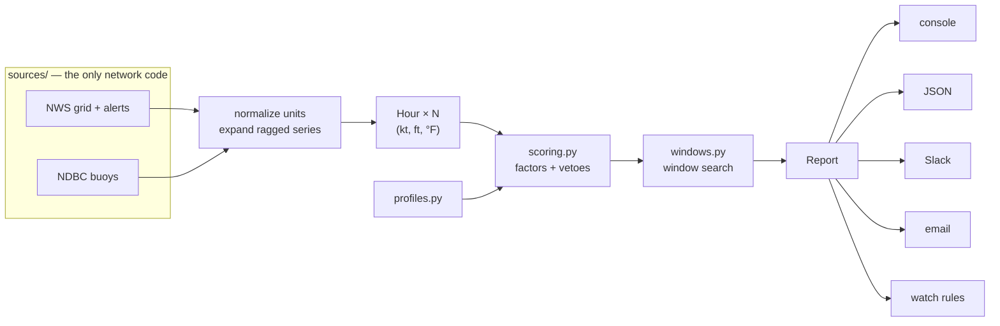

# ⛵ sailing-conditions

**Is it worth going sailing?** A command-line forecast that answers the question a
weather app won't: not *"what is the weather"*, but *"when today is it worth rigging
the boat, for **my** boat?"*

It pulls NOAA's hourly forecast grid, scores every hour against a boat profile with a
transparent model, and searches for the contiguous **windows** worth sailing. It can
also watch your home water and message you when a good one shows up.

[](https://github.com/therealtplum/sailing-conditions/actions/workflows/ci.yml)


```console
$ sail plan chicago --days 1 --explain

⛵ Belmont Harbor  Chicago, IL   keelboat profile
   Lake Michigan. Flat in an offshore westerly, short and steep in a NE blow.
   buoy CHII2: S 4 kt g4 (24 min ago)

╭─ Today  8.5/10 SEND IT ────────────────────────────────────────────────────────────────────╮
│ ▂ ▂ ▂ ▂ ▂ ▂ ▇ ▇ ▇ ▆ ▆ ▅ ▅ ▂                                                                │
│ 6am   9am   12pm  3pm   6pm                                                                │
│ go    12pm–5pm  ·  5h at 8.0/10                                                            │
│ peak  SSE 10 kt g15  ·  2.0 ft seas  ·  feels 76°F  ·  likely rain showers  ·  55% precip  │
│ sun   5:59am – 7:51pm  (13.9 h of daylight)                                                │
│                                                                                            │
│ why 9.0/10 at 12pm                                                                         │
│ factor   score  weight  reading                                                            │
│ wind      1.00       3  in the groove — 10 kt sits in the 10–20 kt band                    │
│ gust      0.84       1  puffy — gusting 5 kt over (1.50x, past 1.35x)                      │
│ sea       1.00     1.5  manageable — 2.0 ft, at or under 3 ft                              │
│ precip    0.61       1  wet — 55% chance of precipitation                                  │
│ comfort   1.00     0.8  pleasant — feels like 76°F                                         │
│ sky       0.62     0.4  likely rain showers — 94% cloud                                    │
╰────────────────────────────────────────────────────────────────────────────────────────────╯
```

Comparing spots:

```console
$ sail compare chicago milwaukee sfbay newport miami --days 3

Sailing outlook
 spot             day       score  verdict  window    shape
 Newport          Tomorrow    9.9  SEND IT  1pm–9pm   ▂▂▂▂▂▂▄▇███████
 Berkeley Circle  Today       9.8  SEND IT  6am–9pm   ▆▆▆▆▆▇█████████
 Milwaukee        Tomorrow    9.7  SEND IT  9am–9pm   ▁▂▄▅▆▆▇▇███▇▇▆▆
 Belmont Harbor   Tomorrow    8.9  SEND IT  8am–9pm   ▁▁▆▇▇▇▇▇▇▇▇▇▇▆▆
 Biscayne Bay     Today       8.9  SEND IT  7am–11am  ▇▇▆▆▅▅▆▆▆▆▆▆▆▇
```

---

## Install

Python 3.11 or newer.

```bash
git clone https://github.com/therealtplum/sailing-conditions
cd sailing-conditions
uv venv && source .venv/bin/activate
uv pip install -e ".[dev]"
```

NOAA asks API clients to identify themselves. Set a contact address once:

```bash
export SAILING_CONTACT="you@example.com"
```

## Commands

| Command | What it does |
| --- | --- |
| `sail now [spots…]` | Today's windows plus live buoy conditions |
| `sail plan [spots…] -d 3` | The next few days, one panel per day |
| `sail week [spots…]` | The full seven-day outlook |
| `sail compare [spots…]` | One line per spot, ranked — where should I drive to? |
| `sail spots [--tag great-lakes]` | The spot registry |
| `sail profiles` | Boat profiles and their wind bands |
| `sail watch [--dry-run]` | Evaluate your watch rules and notify |

Useful flags: `--profile dinghy`, `--explain`, `--json` (add `--compact` to drop the
hour-by-hour detail), `--min-score 7.5`, `--no-live`, `--no-cache`, `--no-color`.

```bash
sail now chicago --profile dinghy --explain
sail week sfbay --json | jq '.reports[0].days[] | {date, score}'
sail compare chicago milwaukee cleveland -d 5
```

## How the score works

Each hour gets a score from 0 to 10 in two stages.

### 1. A weighted geometric mean of continuous factors

Every factor maps a physical quantity onto `[0, 1]` through a response curve whose
breakpoints come from your boat profile. Wind is a trapezoid — too little is as
useless as too much:

```
 1.0 │        ┌───────────────┐            keelboat: 5 / 10 / 20 / 30 kt
     │       ╱                 ╲
 0.5 │      ╱                   ╲
     │     ╱                     ╲
 0.0 │────┘                       └────
     └────┬────┬────┬────┬────┬────┬────
          5   10   15   20   25   30  kt
```

| Factor | Reads | Default weight | Response |
| --- | --- | --- | --- |
| `wind` | sustained wind | 3.0 | trapezoid across the profile's band |
| `sea` | wave height | 1.5 | 1.0 up to the comfort limit, falling to the max |
| `gust` | gust ÷ sustained | 1.0 | ratio-based — 12 kt gusting 30 is harder than a steady 25 |
| `precip` | probability of precipitation | 1.0 | linear, floored (rain is annoying, not disqualifying) |
| `comfort` | apparent temperature | 0.8 | trapezoid across a comfortable band |
| `sky` | cloud cover | 0.4 | mild preference for sunshine |

They combine as a weighted geometric mean:

$$S = 10 \cdot \Bigl(\prod_i f_i^{\,w_i}\Bigr)^{1/\sum_i w_i}$$

A geometric mean, not an average, because sailing quality is **conjunctive**:
brilliant sunshine does not compensate for no wind. Any single bad factor drags the
result toward zero, which is what a sailor expects — while an arithmetic mean would
happily call a windless, sunny, warm day an 8.

**Missing data is dropped from both the product and the weight sum.** An inland lake
with no wave grid is scored on what is known rather than penalized for what is not.

### 2. Hard vetoes

Some conditions aren't trade-offs at all. These cap the score outright:

| Veto | Cap | Hard? |
| --- | --- | --- |
| Probability of thunder over the profile's threshold | 1.0 | yes — no-go |
| Wind at or past the boat's maximum | 2.5 | yes |
| Gale / Storm / Special Marine Warning, severe thunderstorm or tornado | 1.0 | yes |
| Small Craft Advisory and similar | 4.5 | no — your call |
| Seas past the profile's limit | 3.0 | no — your call |

Vetoes are applied *after* the mean, so `--explain` can still say "9/10 conditions,
capped by a Special Marine Warning" — much more useful than a bare 1.0.

### 3. Window search

The day score is the mean of its **best three daylight hours**: one dead morning
shouldn't erase a glorious afternoon, and one flukey hour shouldn't carry the day.
Windows are maximal runs of consecutive hours at or above the threshold, ranked by
mean score — every qualifying hour in a row, never a subset chosen to flatter the
average. Hours whose midpoint falls after sunset are excluded.

### Boat profiles

The rules are the same for everybody; the constants are data. The same Chicago
afternoon — 10 kt gusting 15, 2 ft of chop — scored three ways:

```console
$ sail now chicago --profile beginner    →  8.2/10  GO SAILING
$ sail now chicago --profile keelboat    →  8.5/10  SEND IT
$ sail now chicago --profile heavy_air   →  1.9/10  NO-GO
```

The heavy-air sailor is right to stay home: 10 kt is *under* that profile's 10 kt
floor. Nobody is wrong, they just own different boats.

| Profile | Wind band (min–ideal–max) | Seas ok/max |
| --- | --- | --- |
| `keelboat` | 5 – 10–20 – 30 kt | 3.0 / 5.5 ft |
| `dinghy` | 4 – 8–16 – 24 kt | 1.5 / 3.5 ft |
| `catamaran` | 6 – 11–22 – 32 kt | 2.0 / 4.0 ft |
| `cruiser` | 5 – 9–16 – 24 kt | 2.0 / 4.0 ft |
| `beginner` | 3 – 6–12 – 18 kt | 1.0 / 2.5 ft |
| `heavy_air` | 10 – 16–28 – 40 kt | 4.5 / 9.0 ft |
| `foiler` | 8 – 12–22 – 30 kt | 1.2 / 3.0 ft |

These are rules of thumb, meant to be argued with. Override them in your config.

## Where the data comes from

| Source | Endpoint | What it provides |
| --- | --- | --- |
| NWS gridpoints | `/gridpoints/{office}/{x},{y}` | hourly wind, gusts, direction, wave height, thunder and precipitation probability, sky cover, apparent temperature |
| NWS points | `/points/{lat},{lon}` | grid coordinates and the authoritative IANA timezone |
| NWS alerts | `/alerts/active?point=` | live watches, warnings and advisories |
| NDBC | `realtime2/{station}.txt` | live buoy observations — wind, gusts, seas, water temperature |
| Local | NOAA solar algorithm | sunrise, sunset and solar noon |

Two things worth calling out:

**The quantitative grid, not the prose.** NWS generates sentences like *"west wind 10
to 15 mph"* from a numeric grid, and publishes both. This reads the grid: typed values
with declared units, at hourly resolution, including elements the prose never mentions
(probability of thunder, gust spread, apparent temperature). Conversion is driven by
the declared unit and an unrecognized unit **raises** rather than silently passing a
1.6× error downstream.

**The buoy is the reality check.** When forecast and observation disagree materially,
the report says so:

```
· Buoy CHII2 reads 22 kt against a 9 kt forecast (+13 kt) — trust the water.
```

Responses are cached on disk with per-endpoint TTLs (30 days for grid metadata, 30
minutes for forecasts, 5 minutes for alerts), retried with exponential backoff and
jitter, and sent with an identifying User-Agent — NOAA's API is free and it is worth
being a good citizen on it.

## Configuration

`~/.config/sailing-conditions/config.toml` (override with `SAILING_CONFIG`). See
[`config.example.toml`](config.example.toml).

```toml
[defaults]
profile = "keelboat"
spots = ["chicago"]
min_score = 6.5

# Your home water — same schema as the built-ins.
[spots.myclub]
name = "Columbia YC"
region = "Chicago, IL"
lat = 41.867
lon = -87.606
buoy = "CHII2"

# Your boat. Anything you leave out is inherited from `extends`.
[profiles.my_j24]
extends = "keelboat"
name = "My J/24"
wind = { min = 6, ideal_lo = 11, ideal_hi = 22, max = 30 }
wave_max_ft = 4.5

# Standing question: "tell me when it's good."
[[watch]]
spot = "myclub"
profile = "my_j24"
min_score = 7.5
min_hours = 3
days = 4
channels = ["slack"]
cooldown_hours = 20
```

Credentials only ever come from the environment, never the config file:

```bash
SLACK_WEBHOOK_URL=…            # or SLACK_BOT_TOKEN + SLACK_CHANNEL
SMTP_HOST= SMTP_PORT= SMTP_USER= SMTP_PASS= EMAIL_FROM= EMAIL_TO=
SAILING_CONTACT=you@example.com
```

## Watching for a good day

`sail watch` evaluates every `[[watch]]` rule and notifies on the first day that
qualifies. It is built to run unattended:

- **It won't spam you.** Each firing is recorded per rule and per forecast date; a
  forecast wobbling between 7.4 and 7.6 all afternoon produces one message, not fifty.
- **It won't lie by omission.** A rule that couldn't be evaluated is reported as an
  error and exits non-zero, rather than being quietly counted as "nothing to report".
- **A dropped message is retried.** State is only recorded once a channel accepts it.

```bash
sail watch --dry-run     # see what would be sent
```

Run it from cron, or from the included GitHub Action
([`.github/workflows/watch.yml`](.github/workflows/watch.yml)) on a schedule with your
webhook in repository secrets:

```cron
0 6,17 * * * SAILING_CONTACT=you@example.com /path/to/.venv/bin/sail watch
```

## Python API

Every layer is usable on its own, and nothing in the domain touches the network.

```python
from sailing_conditions import Settings, SpotRegistry, build_forecaster, get_profile

report = build_forecaster(Settings.load()).report(
    SpotRegistry().get("chicago"), get_profile("dinghy"), days=3
)

print(report.headline())
# Belmont Harbor 8.9/10 — SEND IT. Best 12pm–7pm, S 9 kt g13.

for day in report.days:
    window = day.best_window
    print(day.date, f"{day.score:.1f}", window.describe() if window else "—")
```

Scoring is a pure function you can drive with your own data:

```python
from sailing_conditions import Hour, get_profile, score_hour
import datetime as dt

hour = Hour(time=dt.datetime.now().astimezone(), wind_kt=14, gust_kt=19, wave_ft=2.0)
score = score_hour(hour, get_profile("keelboat"))

print(score.value, score.verdict.label)
for factor in score.factors:
    print(f"  {factor.name:8} {factor.score:.2f} × {factor.weight}  {factor.note}")
```

`--json` output carries a `schema_version` and is a deliberate, stable contract —
scores, verdicts, windows, every factor and every veto.

## Architecture



```
sailing_conditions/
├── models.py       frozen domain types — no I/O, no formatting
├── scoring.py      response curves, vetoes, the weighted geometric mean
├── profiles.py     boat profiles: the constants the model is tuned by
├── windows.py      window search and sparklines
├── sun.py          NOAA solar position, timezone-correct
├── spots.py        spot registry (data/spots.toml + your config)
├── settings.py     TOML preferences, environment secrets
├── service.py      wiring: fetch → score → group → assemble
├── watch.py        standing rules, cooldown state, delivery
├── cli.py          argument parsing and command dispatch
├── sources/        http (retry + cache), nws, ndbc
├── render/         console, jsonout, slack, html — pure functions of a Report
└── notify/         Slack and SMTP, each with an injectable transport
```

The seam that makes this testable is the `Fetcher` protocol: two methods,
`get_text` and `get_json`. Production passes an HTTP client; the test suite passes one
backed by recorded NOAA payloads, so **the entire suite runs the real code paths
offline** — no network, no mocking library.

## Development

```bash
pytest                                   # 245 tests, no network
pytest --cov=sailing_conditions           # ~94% coverage
ruff check . && mypy sailing_conditions   # lint + strict types
python tools/capture_fixtures.py --contact you@example.com   # re-record fixtures
```

Sun calculations are verified against NOAA's algorithm (as implemented by `astral`)
and published almanac times across latitudes from Key West to Longyearbyen, to within
90 seconds. Scoring tests assert *properties* — more wind up to the sweet spot is
better, missing data is not a penalty, a veto beats everything — rather than pinning
magic numbers, so the model stays tunable.

## Limitations

- **US only.** It is built on NOAA/NWS, which covers the United States and its
  territories.
- **A score is not a forecast, and neither is a substitute for judgment.** Check the
  official marine forecast and your own eyes before leaving the dock. Grid forecasts
  smooth over local effects — lake breezes, harbor shadows, current against wind —
  that matter enormously in the last mile.
- **Wave data is coarse or absent** at inland and some coastal grids. The report says
  so rather than silently pretending otherwise.
- Model skill decays with range: day 1 is worth planning around, day 7 is worth a
  glance.

## License

MIT — see [LICENSE](LICENSE). Forecast data courtesy of NOAA's National Weather
Service and National Data Buoy Center, which are public domain.
